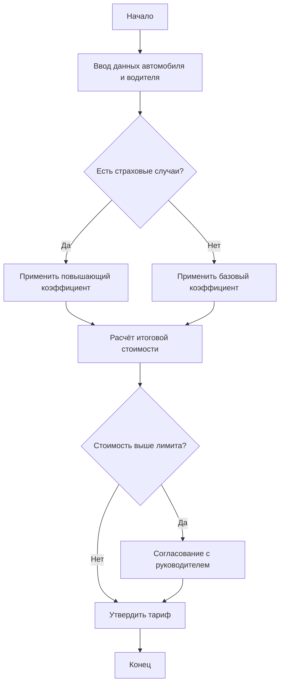

# Flowchart — Расчёт стоимости полиса

```mermaid
flowchart TD
    A[Начало] --> B[Ввод данных автомобиля и водителя]
    B --> C{Есть страховые случаи?}
    C -- Да --> D[Применить повышающий коэффициент]
    C -- Нет --> E[Применить базовый коэффициент]
    D --> F[Расчёт итоговой стоимости]
    E --> F
    F --> G{Стоимость выше лимита?}
    G -- Да --> H[Согласование с руководителем]
    G -- Нет --> I[Утвердить тариф]
    H --> I
    I --> J[Конец]
```
