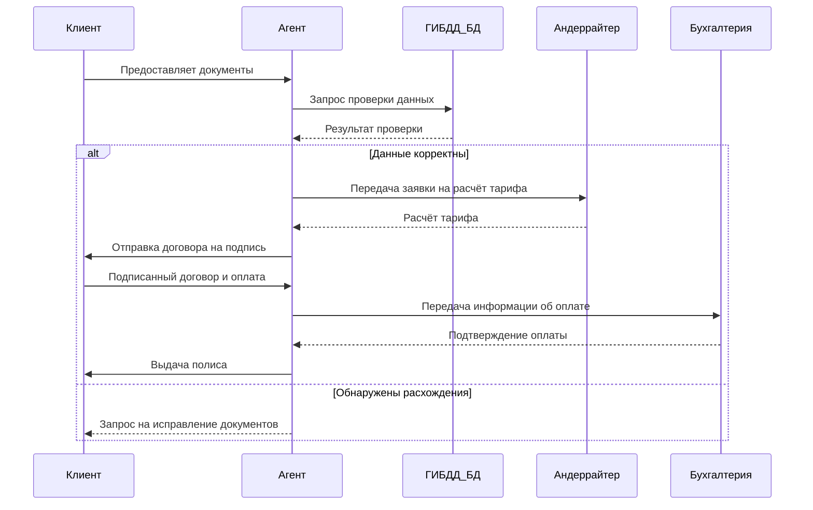

# Sequence Diagram — Оформление страхового полиса

```mermaid
sequenceDiagram
    participant Клиент
    participant Агент
    participant ГИБДД_БД
    participant Андеррайтер
    participant Бухгалтерия

    Клиент->>Агент: Предоставляет документы
    Агент->>ГИБДД_БД: Запрос проверки данных
    ГИБДД_БД-->>Агент: Результат проверки
    alt Данные корректны
        Агент->>Андеррайтер: Передача заявки на расчёт тарифа
        Андеррайтер-->>Агент: Расчёт тарифа
        Агент->>Клиент: Отправка договора на подпись
        Клиент->>Агент: Подписанный договор и оплата
        Агент->>Бухгалтерия: Передача информации об оплате
        Бухгалтерия-->>Агент: Подтверждение оплаты
        Агент->>Клиент: Выдача полиса
    else Обнаружены расхождения
        Агент-->>Клиент: Запрос на исправление документов
    end
```
