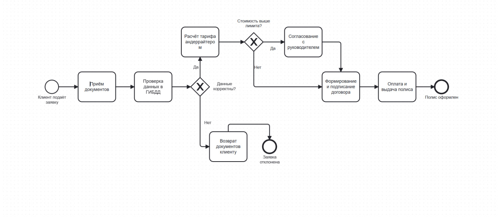
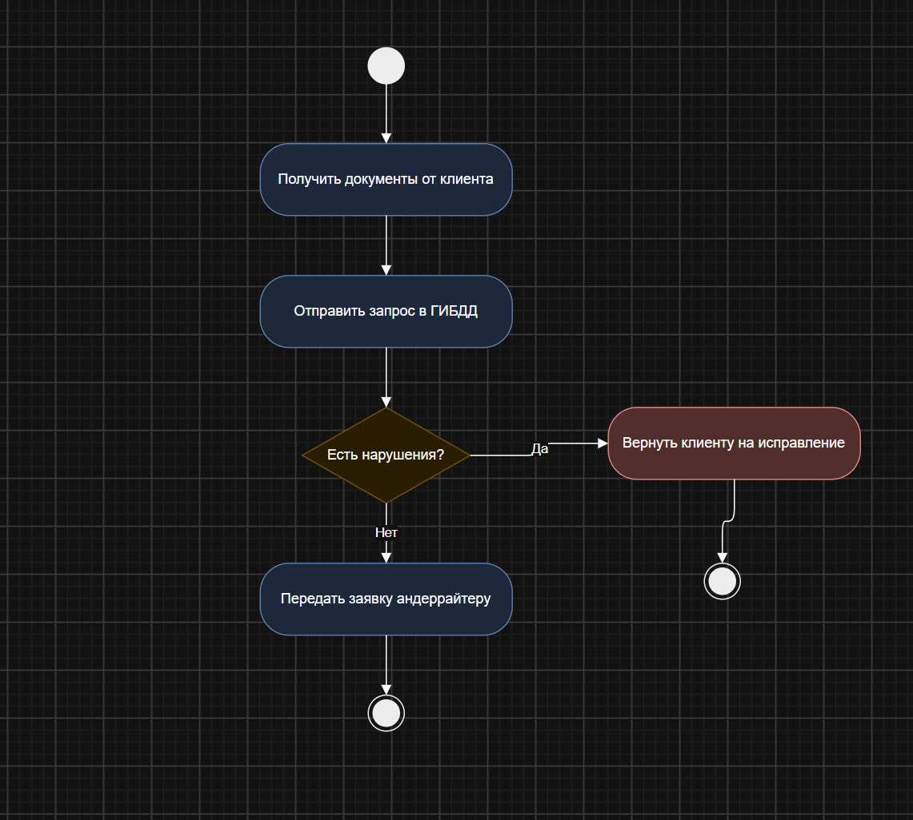

# Отчёт по лабораторной работе №1

## Краткое описание процесса

<Настроил Git-репозиторий, освоить базовые команды и работу
с графическими нотациями (BPMN, UML Activity, Sequence, Flowchart),
сохранил все артефакты в репозитории и на практике увидел разницу между
текстовыми и бинарными форматами при версионировании>

## Диаграммы

### BPMN-диаграмма

### UML Activity Diagram

### Sequence Diagram
См. файл [docs/sequence.md](docs/sequence.md)

### Flowchart
См. файл [docs/flowchart.md](docs/flowchart.md)

## Изменение и diff (Часть 4)

<  так же я добавил такую фуцию для наглядности и полноты картины "Уведомление клиента о статусе" . так же вот пункт с изменениями  которые я вносил 'PS C:\Users\admin\Documents\visual-programming-labs-Dusov> git diff HEAD~1 HEAD -- lab1/diagrams/process.bpmn
diff --git a/lab1/diagrams/process.bpmn b/lab1/diagrams/process.bpmn
index 7e730a0..cdeb7c5 100644
--- a/lab1/diagrams/process.bpmn
+++ b/lab1/diagrams/process.bpmn
@@ -47,7 +47,7 @@
       <bpmn:outgoing>Flow_12</bpmn:outgoing>
     </bpmn:task>
     <bpmn:endEvent id="EndEvent_1" name="Полис оформлен">
-      <bpmn:incoming>Flow_12</bpmn:incoming>
+      <bpmn:incoming>Flow_0jsdfqc</bpmn:incoming>
     </bpmn:endEvent>
     <bpmn:sequenceFlow id="Flow_1" sourceRef="StartEvent_1" targetRef="Task_1" />
     <bpmn:sequenceFlow id="Flow_2" sourceRef="Task_1" targetRef="Task_2" />
@@ -60,125 +60,140 @@
     <bpmn:sequenceFlow id="Flow_9" sourceRef="Task_5" targetRef="Task_6" />
     <bpmn:sequenceFlow id="Flow_10" name="Нет" sourceRef="Gateway_2" targetRef="Task_6" />
     <bpmn:sequenceFlow id="Flow_11" sourceRef="Task_6" targetRef="Task_7" />
-    <bpmn:sequenceFlow id="Flow_12" sourceRef="Task_7" targetRef="EndEvent_1" />
+    <bpmn:sequenceFlow id="Flow_12" sourceRef="Task_7" targetRef="Activity_0jfuy3u" />
+    <bpmn:task id="Activity_0jfuy3u" name="Уведомление клиента о статусе">
+      <bpmn:incoming>Flow_12</bpmn:incoming>
+      <bpmn:outgoing>Flow_0jsdfqc</bpmn:outgoing>
+    </bpmn:task>
+    <bpmn:sequenceFlow id="Flow_0jsdfqc" sourceRef="Activity_0jfuy3u" targetRef="EndEvent_1" />
   </bpmn:process>
   <bpmndi:BPMNDiagram id="BPMNDiagram_1">
     <bpmndi:BPMNPlane id="BPMNPlane_1" bpmnElement="Process_InsurancePolicy">
       <bpmndi:BPMNShape id="StartEvent_1_di" bpmnElement="StartEvent_1">
-        <dc:Bounds x="152" y="242" width="36" height="36" />
+        <dc:Bounds x="152" y="182" width="36" height="36" />
         <bpmndi:BPMNLabel>
-          <dc:Bounds x="133" y="282" width="75" height="27" />
+          <dc:Bounds x="130" y="222" width="80" height="27" />
         </bpmndi:BPMNLabel>
       </bpmndi:BPMNShape>
       <bpmndi:BPMNShape id="Task_1_di" bpmnElement="Task_1">
-        <dc:Bounds x="240" y="220" width="100" height="80" />
+        <dc:Bounds x="240" y="160" width="100" height="80" />
       </bpmndi:BPMNShape>
       <bpmndi:BPMNShape id="Task_2_di" bpmnElement="Task_2">
-        <dc:Bounds x="390" y="220" width="100" height="80" />
+        <dc:Bounds x="390" y="160" width="100" height="80" />
       </bpmndi:BPMNShape>
       <bpmndi:BPMNShape id="Gateway_1_di" bpmnElement="Gateway_1" isMarkerVisible="true">
-        <dc:Bounds x="540" y="235" width="50" height="50" />
+        <dc:Bounds x="540" y="175" width="50" height="50" />
         <bpmndi:BPMNLabel>
PS C:\Users\admin\Documents\visual-programming-labs-Dusov> git diff HEAD~1 HEAD -- lab1/diagrams/process-bpmn.png
diff --git a/lab1/diagrams/process-bpmn.png b/lab1/diagrams/process-bpmn.png
index a2bdb1f..e6f802c 100644
Binary files a/lab1/diagrams/process-bpmn.png and b/lab1/diagrams/process-bpmn.png differ' >

## Выводы

< так  же я понял что ,текстовые форматы Git «понимает» и может сравнивать/сливать по строкам, а бинарные — нет: для системы это неделимая «чёрная коробка», которую можно только заменить целиком.>